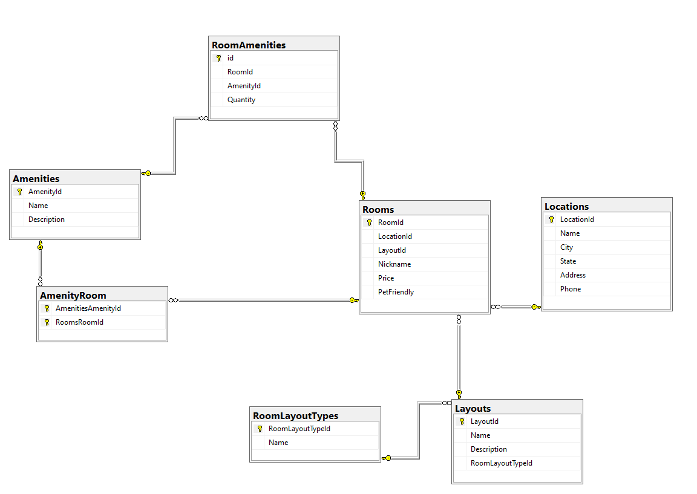

# Async Inn Hotel Asset Management System

Author: Anas Al-Shammah

Date: 16/7/2023

## Description
The Async Inn Hotel Asset Management System is a web-based API designed to help the hotel chain manage their assets effectively. It allows the management of hotel locations, rooms, amenities, and pricing information. The system provides features to add new locations, modify room layouts, associate amenities with rooms, and set room rates per location. 

## ERD Diagram

### Table Explanations

1. Location Table:
   - Primary Key: location_id
   - Attributes: name, city, state, address, phone_number
   - Explanation: Represents the different locations of the Async Inn hotel chain.

2. Room Table:
   - Primary Key: room_id
   - Foreign Key: location_id
   - Attributes: room_number, nickname, price, is_pet_friendly
   - Explanation: Represents individual rooms in each location, including room-specific details and pricing.

3. Amenity Table:
   - Primary Key: amenity_id
   - Attributes: name
   - Explanation: Stores the amenities available in the rooms.

4. RoomAmenity Table (Pure Join Table):
   - Foreign Keys: room_id, amenity_id
   - Explanation: Establishes a many-to-many relationship between rooms and amenities.

5. RoomRate Table (Joint Entity Table with Payload):
   - Composite Primary Key: room_id, location_id
   - Foreign Keys: room_id, location_id
   - Attributes: price
   - Explanation: Stores the pricing information for each room at a specific location.

## Technologies Used
- C#
- Entity Framework
- ASP.NET Web API

## Getting Started
1. Clone the repository.
2. Set up the database and run the migrations.
3. Build and run the API server.
4. Access the API endpoints to manage hotel assets.

## API Endpoints
- `/api/locations`: Manage hotel locations (GET, POST, PUT, DELETE).
- `/api/rooms`: Manage hotel rooms (GET, POST, PUT, DELETE).
- `/api/amenities`: Manage amenities (GET, POST, PUT, DELETE).
- `/api/roomamenities`: Manage the association between rooms and amenities (GET, POST, DELETE).
- `/api/roomrates`: Manage room rates (GET, POST, PUT, DELETE).

## Future Enhancements
- User authentication and authorization.
- Additional endpoints for managing users, bookings, and reservations.
- Integration with payment gateway for online bookings.

